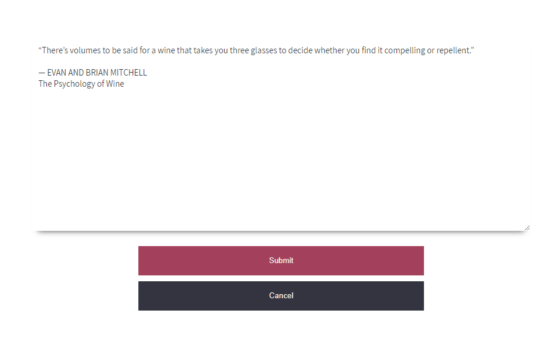

# [Note Taking App](http://fazeelanizam.com/notes/)

This is a React Hooks rewrite (with styles added) of the code as explained in [this article](https://medium.com/@peterjd42/using-local-storage-in-react-to-imitate-database-functionality-a2c339cdc1b5) by [Peter Durham](https://github.com/peterdurham) which was written using React class components. 

## Built With

* [ReactJS](https://reactjs.org/)
* [jQuery](https://jquery.com/)

## Authors

* **Fazeela Nizam** @[fazeelanizam13](https://github.com/fazeelanizam13)
